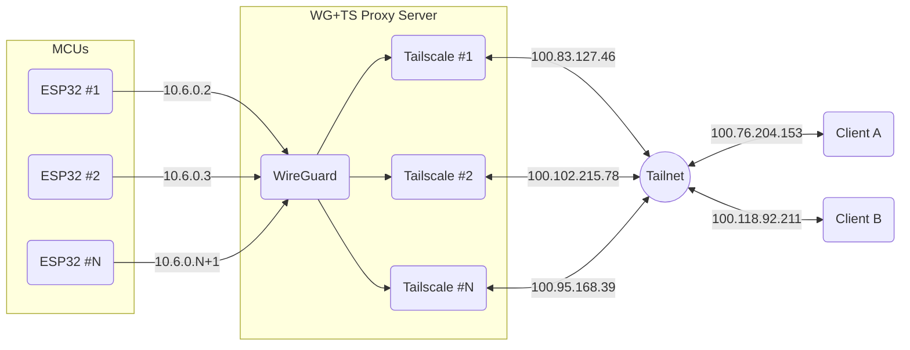

# WireGuard-Tailscale bridge for ESP32

## Overview

This project solves a key limitation in IoT deployments: enabling ESP32 microcontrollers to participate in a Tailscale network despite not having the resources to run the Tailscale client directly. It enables secure remote access to ESP32 devices from anywhere, even when both machines are behind NAT, with unique IPs for each device.

## Problem Statement

Tailscale cannot run directly on microcontrollers like the ESP32 because:
- Limited processing power
- No full operating system
- Memory constraints

However, for IoT applications, we often need to:
- Access devices remotely from anywhere
- Navigate through NAT barriers
- Maintain secure connections
- Give each device a unique, stable IP address

## Solution Architecture

*Tailscale IP addresses are not real, just for illustration*


The solution uses a Linux proxy server that:

1. Runs a WireGuard server that ESP32s connect to
2. Creates isolated network namespaces for each ESP32
3. Runs a separate Tailscale instance in each namespace
4. Routes traffic between WireGuard and Tailscale interfaces

This approach makes each ESP32 appear as a distinct machine in your Tailnet (unlike the solution using `--advertise-routes`), with its own IP address.

This machine can be a low-cost Linux VPS (tested on Oracle & OVH Cloud VPS w/ Ubuntu 22.04) or even a Raspberry Pi / home server, as long as it's exposing the WireGuard port to the outside world + has a fixed IP or hostname.

### Key Components

- **ESP32 Side**: Uses a WireGuard client library to connect to the proxy server
- **Proxy Server**: 
  - Runs Linux with WireGuard and Tailscale installed
  - Uses network namespaces for isolation
  - Manages routing between interfaces
  - Exposes each ESP32 as a unique Tailscale device

## Benefits

- **Security**: Both WireGuard and Tailscale are well-established secure protocols
- **Scalability**: 
  - 30+ ESP32 devices on the smallest servers (1~5 €/month)
  - Easy to scale across multiple servers: proxies are transparent to other Tailscale devices
- **Transparency**: 
  - Other machines in your Tailnet see the ESP32 devices as direct Tailscale nodes. 
  - The Tailscale configuration in each namespace is totally independent & only relies on the auth key provided during commissioning, which means it can even expose Tailscale routes without having access to their host account. There's no dependency on the server's Tailscale login, so a single proxy could theoretically serve ESP32 devices across multiple users/organizations using their respective auth keys.
- **Firewall-friendly**: Works through NAT and restrictive firewalls
- **Low overhead**: Minimal resource requirements on the ESP32

## Implementation Details

### Proxy Server Setup

The proxy server configuration is handled through a series of shell scripts:

1. `setup-esp32.sh`: Main entry point that orchestrates the setup process
2. `isolate-tailscale.sh`: Creates isolated network namespaces
3. `setup-wireguard.sh`: Configures the WireGuard server
4. `run-tailscale-namespace.sh`: Starts Tailscale in the isolated namespace
5. `setup-internal-routing.sh`: Creates routing between interfaces
6. `cleanup.sh`: Removes configurations for cleanup

An additional script `wireguard-monitor.py` is only used for tests. When reconnecting an ESP32 quickly when behind a NAT, it can get an origin port unknown to the WireGuard server for its public key & IP, which it won't update immediately in its configuration. This can cause the ESP32 to be unable to connect for a random amount of time. The script avoids this issue by monitoring the WireGuard connection and reloading it when it detects packets coming from a legit IP with a different, unregistered origin port, which enables the ESP32 to connect quickly after a few handshake attempts.

### ESP32 Test Code

The ESP32 side uses a WireGuard client library adapted from ESPHome [implementation](https://github.com/esphome/esphome/tree/dev/esphome/components/wireguard) & [library](https://github.com/droscy/esp_wireguard). The example implementation includes:

- WireGuard connection management
- Basic HTTP server for testing
- Connection monitoring and auto-reconnection

```cpp
#include <Arduino.h>
#include <ESPAsyncWebServer.h>
#include <EspWireGuard.h>

static EspWireGuard wg;

// Configuration parameters
static const IPAddress WG_LOCAL_IP("10.6.0.2");
static const IPAddress WG_SUBNET("255.255.255.255");
static const IPAddress WG_GATEWAY("192.168.0.1");
static const char* WG_PRIVATE_KEY = "PRIVATE_KEY_HERE";
static const char* WG_ENDPOINT_ADDRESS = "YOUR_SERVER_IP";
static const char* WG_ENDPOINT_PUBLIC_KEY = "PUBLIC_KEY_HERE";
static const uint16_t WG_ENDPOINT_PORT = 51820;

AsyncWebServer server(80);

void setup() {
  // Initialize WireGuard connection
  wg.begin(
    WG_LOCAL_IP,
    WG_SUBNET,
    WG_GATEWAY,
    WG_PRIVATE_KEY,
    WG_ENDPOINT_ADDRESS,
    WG_ENDPOINT_PUBLIC_KEY,
    WG_ENDPOINT_PORT
  );
  
  // Setup web server routes
  server.on("/", HTTP_GET, [](AsyncWebServerRequest *request){
    request->send(200, "text/plain", "Hello from ESP32!");
  });
  
  server.begin();
}

void loop() {
  // WireGuard connection is handled automatically
  delay(100);
}
```

## Setup Instructions

### Prerequisites

- A Linux server (e.g. Ubuntu 22.04) with
  - WireGuard
  - Tailscale
  - Python 3.x
  (will be installed by the scripts if not present)
- PlatformIO + ESP32 Arduino Core 3.0+: [pioarduino](https://github.com/pioarduino/platform-espressif32)

### Server Setup

1. Clone the repository to your server
2. Run the setup script for each ESP32 device:

```bash
sudo ./setup-esp32.sh <esp_name>
```

3. When prompted, get a Tailscale authentication key from your [Tailscale admin console](https://login.tailscale.com/admin/settings/keys)
4. The script will generate a WireGuard configuration for your ESP32
5. The Tailscale node for ESP32 will be commissioned and appear in your Tailscale admin panel

### ESP32 Setup

1. Copy the WireGuard configuration parameters from the server output
2. Insert the parameters into your ESP32 code:
   - Private key
   - Local IP address
   - Endpoint address and port
   - Endpoint public key
3. Compile and upload the code to your ESP32
4. Let it connect to the WireGuard server and handle requests from other Tailscale nodes

## How It Works

- Each ESP32 gets its own isolated Linux network namespace
- A separate Tailscale instance runs in each namespace
- ESP32 connects via WireGuard to the server
- Traffic is seamlessly routed between interfaces with DNAT / `iptables` rules
- Both WireGuard and Tailscale handle NAT traversal

## Testing and Verification

Once setup is complete, you can test the connection:

1. **ESP32 Web Server Test**: Access the ESP32's web server from another Tailscale device using its Tailscale IP address
2. **Ping Test**: Ping the ESP32 from another Tailscale device
3. **Monitoring Connection**: Check the WireGuard connection status on the server

```bash
# Check WireGuard status
sudo wg show

# Check Tailscale status for a specific namespace
sudo ip netns exec esp1 tailscale --socket=/var/run/tailscale-esp1.sock status
```

## Scaling Considerations

- **Single Server Scaling**: A small VPS can typically handle 30-50 ESP32 devices
- **Multiple Server Scaling**: The architecture is inherently distributed
- **Resource Requirements**:
  - Each namespace adds minimal overhead
  - Main limitation is typically network bandwidth, not CPU or memory

## Troubleshooting

### Common Issues

1. **ESP32 Cannot Connect to WireGuard Server**:
   - Check firewall settings on the server
   - Verify the ESP32 has internet connectivity
   - Check that UDP port 51820 is open on the server

2. **Tailscale Instance Not Appearing Online**:
   - Check if the namespace was created correctly
   - Verify the Tailscale authorization key is valid
   - Check tailscaled logs in the namespace

3. **Routing Issues**:
   - Verify iptables rules are set correctly
   - Check that IP forwarding is enabled on the server
   - Verify the network interface configurations

### Diagnostic Commands

```bash
# Check namespace existence
ip netns list | grep esp

# Check interfaces in a namespace
ip netns exec esp1 ip addr

# Check routing in a namespace
ip netns exec esp1 ip route

# View iptables rules
sudo iptables -L -v
sudo iptables -t nat -L -v

# Check WireGuard connections
sudo wg show
```

## Cleanup

To remove all configurations for a specific ESP32:

```bash
sudo ./cleanup.sh <esp_name>
```

To remove all configurations:

```bash
sudo ./cleanup.sh
```

## Advanced Configuration

### Port Forwarding

By default, the setup only forwards HTTP traffic (port 80). To forward additional ports:

1. Edit `setup-internal-routing.sh`
2. Add additional DNAT rules for the desired ports

Example for forwarding TCP port 8080:

```bash
# Add in setup-internal-routing.sh
ip netns exec $NS_NAME iptables -t nat -A PREROUTING -i tailscale-netns -p tcp --dport 8080 -j DNAT --to-destination $ESP_IP:8080
```

## Conclusion

This solution allows IoT-enabled microcontrollers like ESP32 fully participating in Tailscale networks, providing secure remote access with unique IPs. The architecture is scalable, transparent to other Tailscale devices, and works reliably across NAT boundaries.

By using a proxy approach with network namespaces, we overcome the hardware limitations of microcontrollers while still benefiting from Tailscale's secure networking capabilities.